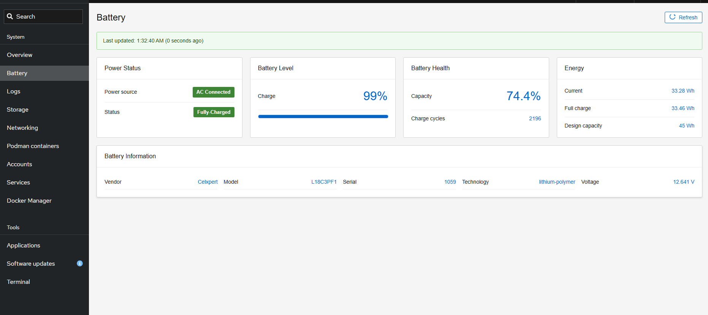

# Cockpit Battery Information Plugin for Cockpit

An open source [Cockpit](https://cockpit-project.org/)([github](https://github.com/cockpit-project/cockpit)) plugin that provides comprehensive real-time battery monitoring for Linux systems. Perfect for tracking laptop battery health, UPS systems, or any battery-powered device in server environments. This plugin gives you detailed insights into battery performance, health status, and specifications.

The plugin integrates seamlessly with Cockpit's web interface, Whether you're managing a single laptop or monitoring multiple battery-powered devices in a server room, this tool provides the visibility you need to keep your systems running smoothly.

## Features

- **Real-time Battery Monitoring**: Displays current battery level, status, and health
- **Visual Progress Bar**: Color-coded battery percentage indicator
- **Battery Health Assessment**: Shows battery capacity and charge cycles
- **Detailed Information**: Vendor, model, serial, technology, voltage, and more
- **Auto-refresh**: Updates every 30 seconds automatically
- **Cockpit Integration**: Seamlessly integrates with Cockpit's web interface
- **Responsive Design**: Works on desktop and mobile devices

## Screenshots



## Installation

### Prerequisites

- UPower daemon (usually pre-installed on most Linux distributions)
- A battery device (laptop battery, UPS, etc.)

### Install Steps 

1. **Clone or download this repository**

2. **Copy files to Cockpit plugins directory**
   ```bash
   sudo mkdir -p /usr/share/cockpit/battery
   sudo cp -r src/* /usr/share/cockpit/battery/
   ```

3. **Set proper permissions**
   ```bash
   sudo chmod 755 /usr/share/cockpit/battery
   sudo chmod 644 /usr/share/cockpit/battery/*
   sudo chmod 755 /usr/share/cockpit/battery/battery-info.sh
   sudo chown -R root:root /usr/share/cockpit/battery
   ```

4. **Restart Cockpit**
   ```bash
   sudo systemctl restart cockpit.socket
   ```

5. **Access the plugin**
   - Open your browser to `https://your-server:9090`
   - Login with your system credentials
   - Look for "Battery" in the left sidebar menu

## What It Shows

### Battery Level Card
- Current battery percentage (0-100%)
- Visual progress bar with color coding:
  - 🟢 Green: 50% and above
  - 🟡 Yellow: 20-49%
  - 🔴 Red: Below 20%

### Status Card
- Current charging/discharging state
- Energy consumption rate (when available)
- Status indicators: Charging, Fully Charged, Discharging

### Battery Health Card
- Battery capacity percentage (health indicator)
- Number of charge cycles
- Color-coded health status

### Energy Information Card
- Current energy level
- Full charge capacity
- Energy units (Wh)

### Detailed Specifications
- Manufacturer and model information
- Serial number
- Battery technology (Li-ion, Li-po, etc.)
- Voltage information
- Design capacity vs. current capacity
- Last update timestamp

## Configuration

The plugin automatically detects your system's primary battery device (`/org/freedesktop/UPower/devices/battery_BAT0`). If your system uses a different battery path, you can modify the `battery-info.sh` script:

```bash
# Change this line in battery-info.sh
OUTPUT=$(upower -i /org/freedesktop/UPower/devices/battery_BAT0 2>&1)

# To use a different battery device, replace with:
OUTPUT=$(upower -i /org/freedesktop/UPower/devices/battery_BAT1 2>&1)
```

## Troubleshooting

### Plugin Not Appearing
1. Check if files are in the correct location: `/usr/share/cockpit/battery/`
2. Verify permissions: `ls -la /usr/share/cockpit/battery/`
3. Restart Cockpit: `sudo systemctl restart cockpit.socket`
4. Clear browser cache (Ctrl+F5)

### No Battery Information
1. Check if UPower is installed: `which upower`
2. Verify battery device exists: `upower -e` (lists all power devices)
3. Check UPower service: `systemctl status upower`

### Permission Errors
- Ensure the `battery-info.sh` script is executable
- Check that cockpit-ws user can access UPower

### Browser Console Errors
- Open browser developer tools (F12)
- Look for Content Security Policy (CSP) violations
- Check for JavaScript errors

## Development and Contributing

This plugin was built to help monitor battery health on older laptops and servers. The code is simple and follows Cockpit's best practices:

Feel free to use, modify, distribute, submit issues, feature requests, or pull requests on GitHub.

## Author

Built by a developer with an old laptop that deserved better battery monitoring! If this helps you extend the life of your devices, that's awesome. 🚀

---

*Note: This plugin requires administrative access to install and may collect system information. Use at your own discretion.*

## Create your own Cockpit Plugin

For detailed instructions on creating a Cockpit plugin [Cockpit StaterKit](https://github.com/cockpit-project/starter-kit) and [myway](./create_custom_plugin.md)
